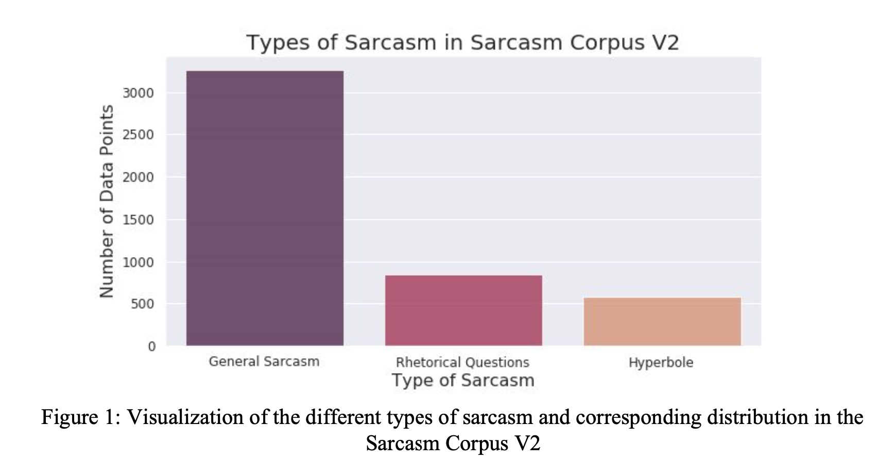
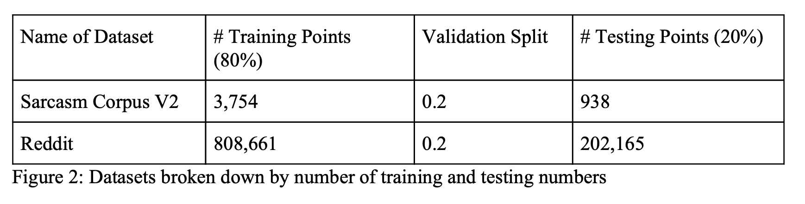
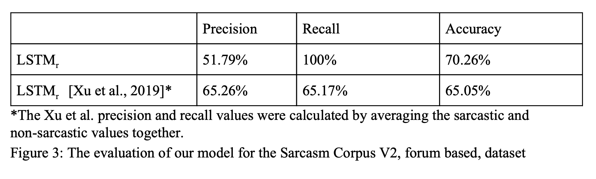
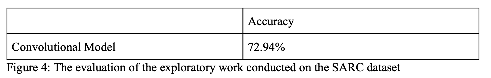

# Natural Language Understanding - Sarcasm Detection
Final project for LIGN 167: Deep Learning for Natural Language Understanding. 

Group Members:
- Meyhaa Buvanesh
- Daniel Eneyew

# **Introduction**
Sentiment analysis is one of the most fundamental tasks in Natural Language Understanding and Processing. However the presence of sarcastic text can flip the polarity of a sentence and thus impact the polarity detection during sentiment analysis across different domains. For example, opinion classification, sarcastically positive user comments may actually be indicative of a negative review during market research. Sarcasm used in online harassment or hate speech online serves as a challenge for algorithms used to flag such comments in online communities.

We humans, ourselves, have a difficult time detecting sarcastic intent. This is not only true when looking at pieces of text without any context, but also when we do not understand the cultural context or social cues referenced in the text. Thus, sarcasm detection is a uniquely challenging computational problem due to its context-dependent nature, especially at a global scale.

This project aims to solve a binary classification problem of categorizing text to be either sarcastic or not sarcastic. Sarcasm, for the scope of this paper, refers to “sharp and often satirical or ironic utterance to cut or give pain”, as defined by the Merriam-Webster dictionary. Sarcasm, for the scope of this paper, refers to “​sharp and often satirical or ironic utterance to cut or give pain”, as defined by the Merriam-Webster dictionary. An example of a sarcastic comment includes the following quote, “If ignorance is bliss. You must be the happiest person on this planet.”

For the scope final paper, we implemented a Vanilla LSTM model using keras. We originally found the inspiration for this project based on the work of Xu et al. [2019] from their project implementing four different models for sarcasm detection: a Vanilla LSTM model, Conditional LSTM model, an LSTM with sentence-level attention, and using the pre-trained BERT classifier. Xu et al. based their work off of the work of Ghosh et al. in investigating the role of context for detecting sarcasm.

# **Model**
### Approach
Our original goal was to implement a Conditional LSTM which would use two LSTM layers, one for the context inputs (LSTMcontext) and one for the reply inputs (LSTMreply) as was done in the Stanford paper we wished to emulate. Unfortunately we ran into a lot of trouble with implementing this model. We had a difficult time trying to understand how to feed inputs to these to LSTM layers while having the output of one feed into the other. Conceptually we understood we wanted to feed the last hidden layer of the context LSTM to the instantiation of the reply (LSTMreply). However, despite numerous attempts we were not able to figure out quite how the connections between layers needed to work for the Conditional LSTM. Thus, because we had such trouble figuring out how to implement the Conditional LSTM we decided to try starting with a Vanilla LSTM and build up to the Conditional from there. We had no direct project examples to use as a guideline or baseline for our model implementation, however tutorials on Keras on how to use the sequential model, layers, preprocessing, and example lstm models helped give us base to adapt for our use case. Additionally other student papers/projects on sentiment analysis helped us understand how to apply Tensorflow and Keras to create our model.

### Vanilla LSTM
Creation of Model: First we create an embedding layer to map our Max number of words to embeddings of size EMBEDDING_DIM (100). Second we create an LSTM Layer with 300 cells. We follow this by using a MaxPooling layer to downsample our data and find the features that are most present in the sample. We read that using a MaxPooling layer can be effective in reducing overfitting which our source papers’ authors mentioned was a problem with their models when training data sets grew in size and when using larger hidden states. Next we initiate a Keras Dropout and set 20% of our inputs to zero. Next we use a Dense (fully connected) layer to convert our output from shape ( , 300) to (, 128). We then again we initiate a Keras Dropout and set 20% of our inputs to zero. Next we use a Dense(fully connected) layer with an Activation of “relu” to convert our output from shape . We once again initiate one final Keras Dropout and set 20% of our inputs to zero. Then we finally use a Dense(fully connected) layer which will take an input of arrays of shape ( , 128) and output arrays of shape ( , 2) for our final output. Then since we are doing multi class classification we use sparse_categorical_crossentropy for our loss function and optimize loss with Adam.

# **Datasets**
The first dataset used for this task was the Sarcasm Corpus V2 [Oraby et. al, 2016]. This dataset is a randomly selected subset of the Internet Argument Corpus (IAC) originally compiled from a discussion forum with three categories of sarcasm types: general sarcasm, hyperbole, and rhetorical questions (Figure 1). The, Sarcasm Corpus V2 subset, dataset contains 4692 total quotes and responses pairs. The labels in the dataset were annotated through crowdsourcing with the label indicating whether the corresponding comment was sarcastic or not.

The second dataset used for this task was the Self-Annotated Reddit Corpus (SARC) with ~1.3 million strong corpus of comments from different subreddits [Khodak et al., 2018]. The labels in this corpus were​ self-annotated by the author of the comments to also indicate whether the corresponding comment was sarcastic or not (1 or 0). The creators of this dataset had already split the SARC into a balanced, with the same number of sarcastic and non-sarcastic comments, training and testing set. However, due to challenges in pre-processing, only the data from the predetermined training set was easily accessible. Thus, we manually split the ~1.01 million points of data left as specified in the Pre-Processing section below.

A notable distinction between these data sets include the means by which the labels were determined. The gold labels for the first forum Sarcasm Corpus V2 were hand-labeled by the reader and thus are indicative of the reader’s perception of sarcasm. Whereas the gold labels for the second SARC were hand-labeled by the author and thus are indicative of the author’s intention of sarcasm.

It is also worth mentioning that both datasets included not only the response comment data and the corresponding label, but also the context quote/question the response was responding to.

### Pre-Processing
The pre-processing for the response columns included shuffling the rows of the dataframe, breaking down each response text into its component sentences, taking out all newlines, tabs, and extraneous characters (such as punctuation, tabs) and making all the text lower case.

The text tokenization utility class from the preprocessing methods in keras was used to tokenize the text and then pad_sequences was used to make all the sequences in a list to have the same length. Tokenization included the use of two methods: fit_on_texts and texts_to_sequences. The ‘fit_on_texts_ method was used to create the vocabulary index needed based on word frequency. The index values are greater than one and lower the integer, the more frequent the word. The ‘text_to_sequences’ then transforms each of the response texts into a sequence of integers based on the corresponding integer value of the word from the vocabulary index just created. The response data was then split, 80/20, into a training and test set with the specific amount of training points listed in Figure 2.

# **Results**

### Formulas Used

Where:

Tp = true positive 

Tn = true negative 

Fp = false positive 

Fn = false negative 

Hyper Parameter tuning was based on Stanford Model. We based our initial choice of hyper parameters on the ones provided in the Stanford source paper for our project. Once we were able to successfully implement our model we began to experiment with parameter tuning. As we experimented with raising the sizes of our hidden layers past a certain threshold we saw a noticeable drop in performance. We noticed the same issue when we used the Reddit dataset and ket our maxword size quite large at 100,000 words. In both cases we saw declines in performance with Accuracy going down and the loss decreased slower.

We also checked the accuracy of our model using the Keras Accuracy metric. When comparing the metric results of our model with the results provided in the source Stanford paper we see that our Vanilla LSTM model performed similarly to the source model (Figure 3) when used for both the Discussion Forum dataset and Reddit Dataset.

# **Conclusion**

### Lessons
Our Vanilla LSTM reaffirms what has been shown in our source project which is that a Vanilla LSTM performs well in some situations, but overall the performance is unbalanced and lacks sufficient information to raise accuracy much higher than fifty to sixty percent. Through working on this project we came to believe that providing more context is key to improving upon the current performance shown by our Vanilla LSTM as well as the four models discussed in our source paper(Vanilla LSTM, Conditional LSTM, Sentence_Level Attention LSTM, and Bert).

### Future Improvements 

#### Pre-Processing

We believe taking out punctuation like quotation marks around words may have had an impact on our results. Often times in written sarcasm punctuation like quotation marks are used to express emotions or sentiments like sarcasm. We believe keeping these punctuations and including them in embeddings may help add context. We learned near the end of working on our project of the the TweetTokenizer() from the tokenize module in the Natural Language Toolkit (nltk) which was specifically designed to work with social media text and leaves certain punctuation and extraneous characters like emoticons made with letters and punctuation in the vocabulary (..., ‘:-)’,...).

#### Model

From our experiments it is clear that there is more to be done to improve current Sarcasm Detection methodologies and we believe that any significant change that can be made to provide more context and aid learning is what is going to further develop this kind of classification.We realized after working on this project that as the source paper we based our project on mentions, the exploration of the usage of a bidirectional LSTM may offer improved performance to current results. This is because Bidirectional LSTMs train an input sequence as given and additionally train a reversed copy of the input sequence which can give the network more context which in turn can lead to faster learning.

# **Acknowledgements**

We would like to thank Professor Leon and TAs Till and Nate for their invaluable support
throughout this quarter, especially the last couple weeks for the project.
